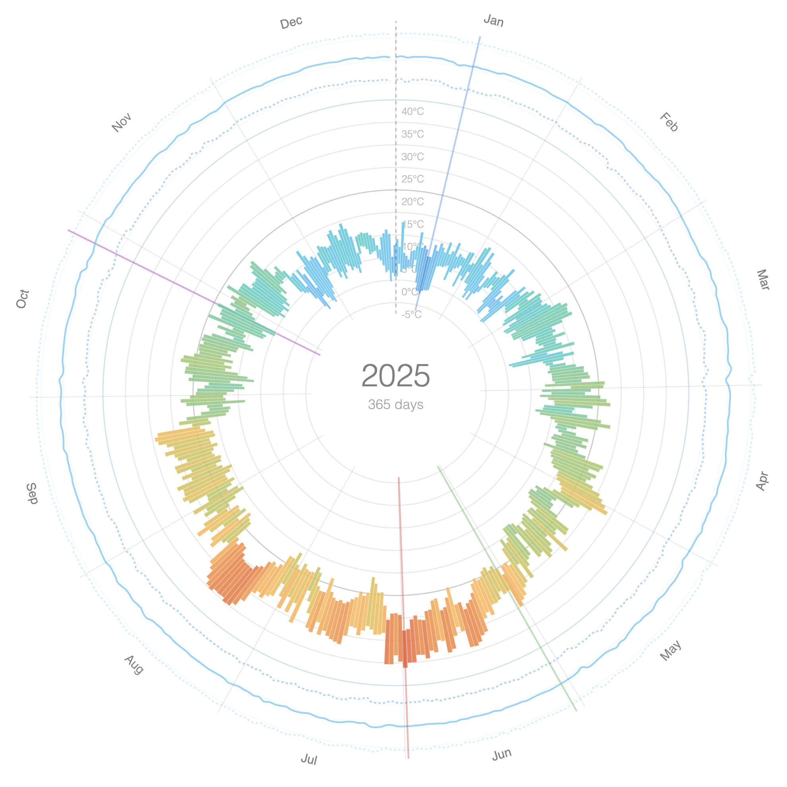
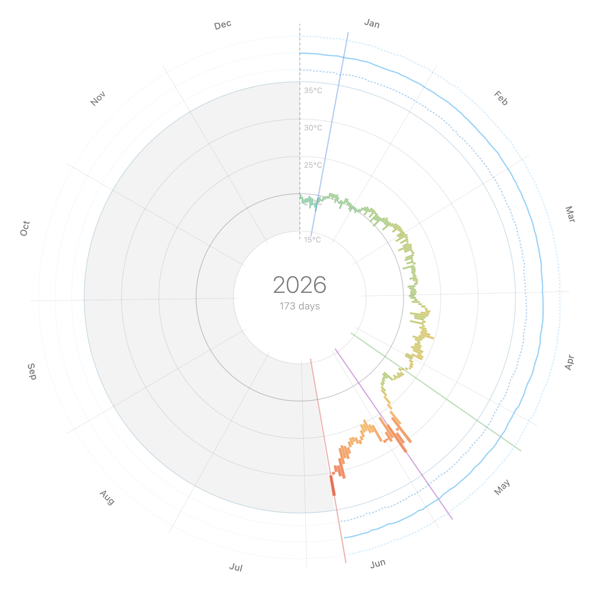

# Data collector

The aim of this project is to use GitHub Actions to periodically collect JSON data from different APIs:

## DHT22
Indoor temperature and humidity readings from a DHT22 sensor, collected hourly.

The dataset includes a [radial "weather wheel" visualization](https://fabiovalse.github.io/data-collector/milan/app-history/) built with D3.js, showing data across the years.

## Milan
Outdoor weather data (temperature, humidity) for Milan via [OpenWeatherMap](https://openweathermap.org/), collected three times daily.

The dataset includes a [radial "weather wheel" visualization](https://fabiovalse.github.io/data-collector/dht22/app-history/) built with D3.js, showing data across the years.

### Weather wheel visualization

The visualization is inspired by the [Weather Radials](https://www.weather-radials.com/) project, with a D3.js adaptation by [Nitaku](https://gist.github.com/nitaku/5f60d143735bdfc7d14c).
